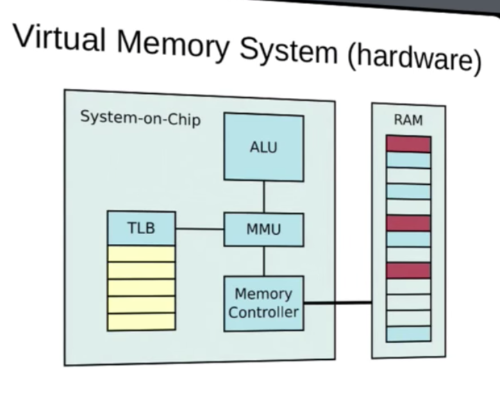
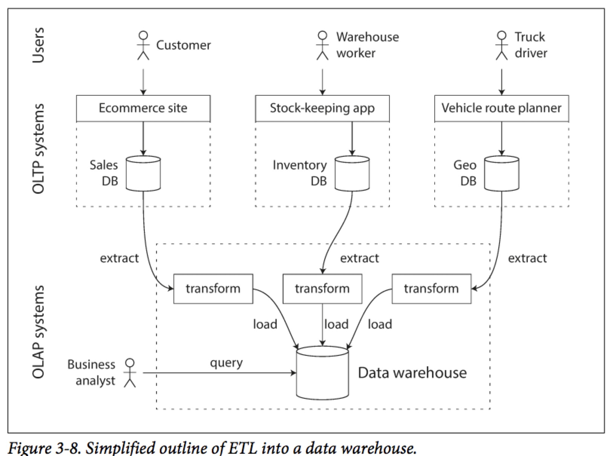

# Decent Programmer
* [Language](#language)
* [OS](#os)
* [Storage](#storage)
* [Network](#network)
* [Architecture](#architecture)


## Language<a id="language"></a>
### Paradigm
### Type System
**Haskell**
- type constructor, data constructor
- generic type and generic funciton
- generic is used to model common behavior, but too general is meaningless or just truth
- which means the implementation is quite limited 
- typeclass/interface adds constrait to the generic types, they are used to model generic
- behavior for a group of types
- algebra data type: sum and product type (enum and record/struct)
   recursive type: list, tree

### Generic & Polymorphism
- **Dynamic polymorphism**
  - vtable, all the object should inhereted from a base class
  - fat pointer which including real object pointer and vtable pointer
  - use dictionary/map as a hidden parameter 
- **Static polymorphism**
  - monomorphisation, generate different version for different type
  - constrait/trait/concept
- **Generic struct/class**
  - Type to generate another concrete type, in Haskell, it's called kind.
  - variance: covariant, contravariant, invariant
- **metaprogramming**
  - macro
  - language hook support


### Data structure

### Memory management
- **Virtual Memory**
  - map virtual addresses to physical RAM
  - map virtual addresses to hardware deivces
  - used by software, in both user or kernel space

- **MMU**
  
  - hardware that transparently handles all memory accesses from Load/Store instructions.
  - also handle permission and Memory move/swap
  - operate on basic units of memory called pages, page is abstract, the physical
    part is called frame
  - a mapping often covers multiple pages
  - memory mapping for a process is save in page table, ``struct_mm``, ``vm_area_struct``
  - TLB as part of MMU, is a list of mapping from virtual to physcial addess space in hardware
    it is limited hardware buffer

- **Page fault**  
generate by MMU when:
  - access the virtual memory which isn't mapped for current process
  - current process has insufficient permissions
  - virtual addresses is valid but has been swapped out

- **linux virtual adddresses**
  - kernel logical address  
    - allocated through kmalloc
    - fixed offset from related physical address  
    - won't be swapped out  
    - virtually contiguous regions are by nature also physically contiguous
      Suitable for DMA transfer  
  - kernel virtual address: 
    - allocated through vmalloc
    - virtually contiguous
  - user virtual address
    - address below PAGE\_OFFSET
    - only used portions of RAM are mapped
    - may be swapped out or move around
    - ``struct mm`` in ``task_struct``

- **lazy allocation**
  - when memory is request, kernel simply create a record in its page table
  - process touch the new memory, cpu will generate the page fault
  - in page fault handler, kernel use its page table to valid the mapping
  - kernel will allocate a physical memory page frame, update the TLB
  - kernel return from the exception handler, and process wil resume

### Concurrency model
- **race condition**
  a flaw in software, which caused by non-determinism event affect the program's correctness
- **data race**
  more than one threads access the same memory location and at least one of them is write
- Models
  - CSP
    - channel + goroutine 
      ring buffer with mutex lock, has point to the reading/writing goroutine block on it   
      select just create a fake goroutine on each channel   

```go
func createQueueFromSlice(slice interface{}) (int, chan interface{}, error) {
    sliceVal := reflect.ValueOf(slice)
    if sliceVal.Kind() != reflect.Slice {
        return 0, nil, ErrInvalidParameter
    }   

    size := sliceVal.Len()
    if size == 0 { 
        return 0, nil, nil 
    }   

    ch := make(chan interface{}, size)
    for i := 0; i < size; i++ {
        ch <- sliceVal.Index(i).Interface()
    }   
    close(ch)
    return size, ch, nil 
}

func Batch(tasks interface{}, worker func(interface{}) (interface{}, error)) (<-chan interface{}, error) {
    workerCount, taskCh, err := createQueueFromSlice(tasks)
    if err != nil {
        return nil, err 
    }   

    var group Group
    resultCh := make(chan interface{}, workerCount)
    for i := 0; i < workerCount; i++ {
        group.Go(func() error {
            for task := range taskCh {
                if result, err := worker(task); err != nil {
                    return err 
                } else {
                    resultCh <- result
                }   
            }   
            return nil 
        })  
    }   
    err = group.Wait()
    close(resultCh)
    return resultCh, err 
}
```
- Async future/promise

## OS<a id="os"></a>
### Linux
1. Linux API
  It composed out of the system call interface of the linux kernel and subroutines
  in GNU c library.
1. Linux ABI
  Application binary interface refers to the compiled binaries in machine code, therefore
  ABI is bound to the intruction set. It's a task for linux distributions. An ABI has 
  to defined for very instruction set such as x86, x86-64, MIPS, ARMv7 with endianness.

## Storage<a id="storage"></a>
### Block device
### File system
### Database
1. Data model
  relational data model could handle all three relationship, but if the relationship is
more common in one type, the other two data model will be more appropirate
  - one-to-many: document
  - many-to-one: 
  - many-to-many: graph
1. SQL
  - **SQLite**  
  
1. NOSQL
  - Document
  - Graph
1. Data Structure
  - **B+ tree**
    - page as basic unit and update in place
    - random write is slow than append only
    - one update may change several pages
    - mature enought and has stable performance
  - **Log-Structured Merge Tree(LSM)**
    - append only write
    - additional backgroud compact process is mandatory
    - when compacting pace counld catch up with write pace, with limited disk bandwidth,
      the performance may downgrade and unpredictable
  - **RocksDB**
    - Memtable, Transaction log, Static Sorted Table(SST)
    - Key, Value are sorted and has associated timestamp
    - Always append new operation(update or delete), without update old record.
    - Read will go through Memtable and SST then merged based on timestamp
    - Use bloom filter to decide whether a SST file contains a given key
    - Backend compact process to merge the SST files then free the space
  - OLTP vs OLAP
    
  - Row vs Column oriented storage
    - for table with wide columns, some query pattern only need seldom part
    - store each column in one file with same order based on row number
    - Normally the number of distinct value in column is samll, which lend it to compression


## Network<a id="network"></a>
### TCP/IP
### Mobile network
### Async programming
### Virtualization

## Architecture<a id="architecture"></a>
### Distribute system
- **Design Principles**
  - Test recovery procedures
  - Automatically recover from failure
  - Scale horizontally to increate aggregate system availability
  - Stop guessing capacity
  - Mange change in automation
- **Application Design for Availablity**
  - Fault Isolation Zones
  - Redundant components
  - Micro-service architecture
  - Recovery oriented Computing: roll back changes, monitoring and diagnostics.
  - Distributed systems best priactices
    - Throttling
    - Retry with exponential fallback
    - Fail fast
    - Use of idempotency tokens/interface
    - Constant work
    - Circuit breaker
    - Bi-modal behavioir and static stability
- **Monitoring and Alarming**
  - Generation
  - Aggregation
  - Real-time processing and alarming
  - Storage and analytics
- **consistency**
  - Master-Slave
  - Conflict-free replicated data type (CRDT)
  - Consensus
    - network model: fully sync, sync, partial sync, async
    - failure model: crash failure vs Byzantine failure
- encoding/decoding
  - rpc
  - rest
  - message broker
- replication
  - leader based
    - all write goes to leader
    - synchronize vs asynchronize
    - add node
      - follower get snapshot from leader
      - ask all the data change since the snapshot, try to catch up
    - recover node
      - get data change since the last check point from leader
    - eventually consistency
      - read after write, when reading something that the user may modified, read
        from leader; otherwise, read it from follower.
      - each user always makes their reads from the same replica to avoid monotonic reads
        monotonic reads cause time appears to go backward.
  - leader-less
    - client write to all nodes and wait for at least w nodes to report succeed 
    - client read the data from r nodes, and do data fix when some nodes has stale data
    - w + r > node count
    - there is no gurantee that client won't read stale data, it's a eventually consistent system
    - sloppy quorums are used when w available node aren't available for a specific user, the 
      system could still accept the write. and when the node come back, a hinted handoff will 
      be executed to write the data to the right node, sloppy quorums particularly useful for
      increasing write availability. 
    - detecting concurrent writes
      - LWW(last write wins) although could make sure eventually consistent potentially lose data
      - Version vector(version clock), return version number to client, and client should carray 
        the version when
        they do write, which let server knows the sequence.
- partition/sharding
  - partition is the base unit for replication
  - partition by key range
  - partition by hash of key/use compound key for range query
  - global secondary index
  - reblancing
    - partition number is bigger than node 
    - partition is the basic unit which will be moved between nodes
    - static vs dynamic partition, since partition size is proportional to partition count
  - request routing
    - any node could handle the request, if it isn't the owner, it will forward the query
    - has a routine tier
    - let client knows the owner of each partition
    - parallel query execution
     

