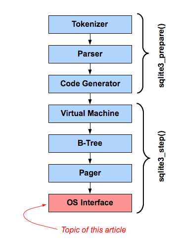

# Decent Programmer
* [Language](#language)
* [OS](#os)
* [Storage](#storage)
* [Network](#network)
* [Architecture](#architecture)

## Language
### Paradigm
### Type System
**Haskell**
- type constructor, data constructor
- generic type and generic funciton
- generic is used to model common behavior, but too general is meaningless or just truth
- which means the implementation is quite limited 
- typeclass/interface adds constrait to the generic types, they are used to model generic
- behavior for a group of types
- algebra data type: sum and product type (enum and record/struct)
   recursive type: list, tree

### Generic & Polymorphism
- **Dynamic polymorphism**
  - vtable, all the object should inhereted from a base class
  - fat pointer which including real object pointer and vtable pointer
  - use dictionary/map as a hidden parameter 
- **Static polymorphism**
  - monomorphisation, generate different version for different type
  - constrait/trait/concept
- **Generic struct/class**
  - Type to generate another concrete type, in Haskell, it's called kind.
  - variance: covariant, contravariant, invariant
- **metaprogramming**
  - macro
  - language hook support

### Data structure

### Memory management
- **Virtual Memory**
  - map virtual addresses to physical RAM
  - map virtual addresses to hardware deivces
  - used by software, in both user or kernel space

- **MMU**
  
  - hardware that transparently handles all memory accesses from Load/Store instructions.
  - also handle permission and Memory move/swap
  - operate on basic units of memory called pages, page is abstract, the physical
    part is called frame
  - a mapping often covers multiple pages
  - memory mapping for a process is save in page table, ``struct_mm``, ``vm_area_struct``
  - TLB is limited hardware buffer

- **Page fault**  
generate by mmu when:
  - access the virtual memory which isn't mapped for current process
  - current process has insufficient permissions
  - virtual addresses is valid but has been swapped out

- **linux virtual adddresses**
  - kernel logical address  
    - allocated through kmalloc
    - fixed offset from related physical address  
    - won't be swapped out  
    - virtually contiguous regions are by nature also physically contiguous
      Suitable for DMA transfer  
  - kernel virtual address: 
    - allocated through vmalloc
    - virtually contiguous
  - user virtual address
    - address below PAGE\_OFFSET
    - only used portions of RAM are mapped
    - may be swapped out or move around
    - ``struct mm`` in ``task_struct``

- **lazy allocation**
  - when memory is request, kernel simply create a record in its page table
  - process touch the new memory, cpu will generate the page fault
  - in page fault handler, kernel use its page table to valid the mapping
  - kernel will allocate a physical memory page frame, update the TLB
  - kernel return from the exception handler, and process wil resume

### Concurrency model
- **race condition**
  a flaw in software, which caused by non-determinism event affect the program's correctness
- **data race**
  more than one threads access the same memory location and at least one of them is write

## OS
### Linux
1. Linux API
  It composed out of the system call interface of the linux kernel and subroutines
  in GNU c library.
1. Linux ABI
  Application binary interface refers to the compiled binaries in machine code, therefore
  ABI is bound to the intruction set. It's a task for linux distributions. An ABI has 
  to defined for very instruction set such as x86, x86-64, MIPS, ARMv7 with endianness.

## Storage
### Block device
### File system
### Database
1. SQL
  - **SQLite**  
  
1. NOSQL
1. Data Structure
  - **B+ tree**
  - **Log-Structured Merge Tree(LSM)**
  - **RocksDB**
    - Memtable, Transaction log, Static Sorted Table(SST)
    - Key, Value are sorted and has associated timestamp
    - Always append new operation(update or delete), without update old record.
    - Read will go through Memtable and SST then merged based on timestamp
    - Use bloom filter to decide whether a SST file contains a given key
    - Backend compact process to merge the SST files then free the space
 * Log-Structured Hash-table

## Network
### TCP/IP
### Mobile network
### Async programming
### Virtualization

## Architecture
### Distribute system
- **Design Principles**
  - Test recovery procedures
  - Automatically recover from failure
  - Scale horizontally to increate aggregate system availability
  - Stop guessing capacity
  - Mange change in automation
- **Application Design for Availablity**
  - Fault Isolation Zones
  - Redundant components
  - Micro-service architecture
  - Recovery oriented Computing: roll back changes, monitoring and diagnostics.
  - Distributed systems best priactices
    - Throttling
    - Retry with exponential fallback
    - Fail fast
    - Use of idempotency tokens/interface
    - Constant work
    - Circuit breaker
    - Bi-modal behavioir and static stability
- **Monitoring and Alarming**
  - Generation
  - Aggregation
  - Real-time processing and alarming
  - Storage and analytics
