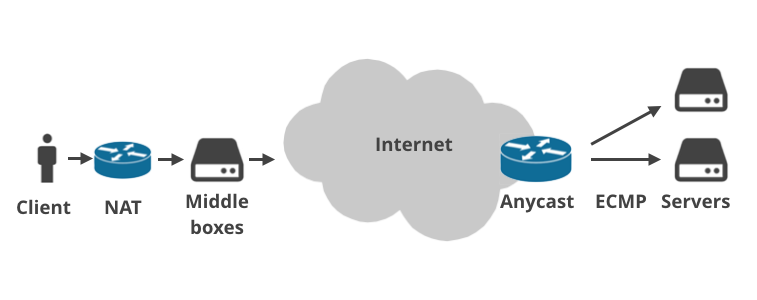

# Network

## Top level principle
  *  Packet Switched (opposed to Circuit Switched)
  * 


## TCP/IP
  * Fragment
    What is the maximum packet size that can be handled by operating 
    systems on both ends?
    What is the maximum permitted datagram size that can be safely 
    pushed through the physical connections between the hosts?

    When a packet is too big for a physical link, an intermediate router 
    might chop it into multiple smaller datagrams in order to make it fit. 
    This process is called "forward" IP fragmentation and the smaller datagrams 
    are called IP fragments

    Fragment usually cause problems
    1 To successfully reassemble a packet, all fragments must be delivered. 
    No fragment can become corrupt or get lost in-flight. There simply is no 
    way to notify the other party about missing fragments!
    2 The last fragment will almost never have the optimal size. For large 
    transfers this means a significant part of the traffic will be composed of 
    suboptimal short datagrams - a waste of precious router resources.
    3 Before the re-assembly a host must hold partial, fragment datagrams in 
    memory. This opens an opportunity for memory exhaustion attacks.
    4 Subsequent fragments lack the higher-layer header. TCP or UDP header is 
    only present in the first fragment. This makes it impossible for firewalls 
    to filter fragment datagrams based on criteria like source or destination ports

    A solution to these problems was included in the IPv4 protocol. A sender 
    can set the DF (Do not Fragment) flag in the IP header, asking intermediate 
    routers never to perform fragmentation of a packet. Instead a router with a 
    link having a smaller MTU will send an ICMP message backward and inform the 
    sender to reduce the MTU for this connection. This mechanism is called Path 
    MTU Discovery. The TCP protocol always sets the DF flag

    Due to ECMP routing. The ICMP message will most likely get delivered to the 
    wrong server - the 5-tuple hash of ICMP packet will not match the 5-tuple hash 
    of the problematic connection.

  * Socket
    A TCP/UDP connection is identified by a tuple of five values: 
      {<protocol>, <src addr>, <src port>, <dest addr>, <dest port>}
    Any unique combination of these values identifies a connection. As a result, 
    no two connections can have the same five values, otherwise the system would not 
    be able to distinguish these connections any longer.
    The protocol of a socket is set when a socket is created with the socket() function. 
    The source address and port are set with the bind() function. The destination address 
    and port are set with the connect() function. Since UDP is a connectionless protocol, 
    UDP sockets can be used without connecting them. Yet it is allowed to connect them and 
    in some cases very advantageous for your code and general application design. In 
    connectionless mode, UDP sockets that were not explicitly bound when data is sent over 
    them for the first time are usually automatically bound by the system, as an unbound UDP 
    socket cannot receive any (reply) data. Same is true for an unbound TCP socket, it is 
    automatically bound before it will be connected.

    If you explicitly bind a socket, it is possible to bind it to port 0, which means "any port". 
    Since a socket cannot really be bound to all existing ports, the system will have to 
    choose a specific port itself in that case (usually from a predefined, OS specific 
    range of source ports). A similar wildcard exists for the source address, which can 
    be "any address" (0.0.0.0 in case of IPv4 and :: in case of IPv6). Unlike in case of 
    ports, a socket can really be bound to "any address" which means "all source IP addresses 
    of all local interfaces". If the socket is connected later on, the system has to choose 
    a specific source IP address, since a socket cannot be connected and at the same time be 
    bound to any local IP address. Depending on the destination address and the content of 
    the routing table, the system will pick an appropriate source address and replace the 
    "any" binding with a binding to the chosen source IP address.
  
    A socket has a send buffer and if a call to the send() function succeeds, it does not 
    mean that the requested data has actually really been sent out, it only means the data 
    has been added to the send buffer. For UDP sockets, the data is usually sent pretty soon, 
    if not immediately, but for TCP sockets, there can be a relatively long delay between 
    adding data to the send buffer and having the TCP implementation really send that data. 
    As a result, when you close a TCP socket, there may still be pending data in the send buffer, 
    which has not been sent yet but your code considers it as sent, since the send() call succeeded. 
    If the TCP implementation was closing the socket immediately on your request, all of this 
    data would be lost and your code wouldn't even know about that. TCP is said to be a 
    reliable protocol and losing data just like that is not very reliable. That's why a socket 
    that still has data to send will go into a state called TIME_WAIT when you close it. In 
    that state it will wait until all pending data has been successfully sent or until a 
    timeout is hit, in which case the socket is closed forcefully.

    The amount of time the kernel will wait before it closes the socket, regardless if it 
    still has pending send data or not, is called the Linger Time. The Linger Time is globally 
    configurable on most systems and by default rather long (two minutes is a common value 
    you will find on many systems). It is also configurable per socket using the socket option 
    SO_LINGER which can be used to make the timeout shorter or longer, and even to disable it 
    completely. Disabling it completely is a very bad idea, though, since closing a TCP socket 
    gracefully is a slightly complex process and involves sending forth and back a couple of 
    packets (as well as resending those packets in case they got lost) and this whole close 
    process is also limited by the Linger Time. If you disable lingering, your socket may not 
    only lose pending data, it is also always closed forcefully instead of gracefully, which 
    is usually not recommended. And even if you disabled lingering with SO_LINGER, if your process 
    dies without explicitly closing the socket, BSD (and possibly other systems) will linger 
    nonetheless, ignoring what you have configured. This will happen for example if your code 
    just calls exit() (pretty common for tiny, simple server programs) or the process is killed 
    by a signal (which includes the possibility that it simply crashes because of an illegal 
    memory access). So there is nothing you can do to make sure a socket will never linger under 
    all circumstances. 

    The question is, how does the system treat a socket in state TIME_WAIT? If SO_REUSEADDR is 
    not set, a socket in state TIME_WAIT is considered to still be bound to the source address 
    and port and any attempt to bind a new socket to the same address and port will fail until 
    the socket has really been closed, which may take as long as the configured Linger Time. 
    So donot expect that you can rebind the source address of a socket immediately after closing 
    it. In most cases this will fail. However, if SO_REUSEADDR is set for the socket you are 
    trying to bind, another socket bound to the same address and port in state TIME_WAIT is 
    simply ignored, after all its already "half dead", and your socket can bind to exactly the 
    same address without any problem. In that case it plays no role that the other socket may 
    have exactly the same address and port. Note that binding a socket to exactly the same address 
    and port as a dying socket in TIME_WAIT state can have unexpected, and usually undesired, 
    side effects in case the other socket is still "at work" 

* Docker and virtual network
  local bridge network
    bridge
    tun/tap device
    iptable
  overlay network
    vxlan(vtep, udp tunnel)

  * 
* AIO/DIO(async Direct IO)
  

 ```
  计世资讯（CCW Research）预计，按照销售额计算，2016年中国服务器虚拟化市场规模将达到21.7亿元。 
  到2020年，市场规模将达到44.1亿元。
 ```

## Virtualization Solution & CMP(Cloud Management Platform)

### VMWare

### OpenStack

## Why Virtualization & Private Cloud?
* Converged Infrastructure 
    * Virtual Machine/Compute
        * Cloud compution(On-demand self service, Resource pooling, Rapid elasticity, Measured service)
        * Multi-tenant isolation and resource limitation

    * Virtual Network
        * Central control over/knowledge of logical network topology
        * Decouple control and data plane
        * Network isolation
        * Virtualize network device(switch, router, load balance, firewall)
        * Programmatic integration with CMP

    * Virtual Storage
* Benefit
    * Wire once
    * Agility and flexibility 
    * Visibility 

* Virtual device
    * Distributed version(vDS), software is much easier to create abstraction

## Common Networking Challenges in Private Cloud Environment

* Manually Network configuration for VM is time-consuming and error-prone
* Solutions lack visibility and auditing capability
* Lack of centrialize IP address and DNS managelent

## Available Solution

### Infoblox Cloud Network Automation

* Support mainstream cloud management platform(CMP, 2014)
* Architecutre 
    * Adaptor
    * Cloud Platform Applicance
    * Grid Master

    Infoblox Cloud Platform Appliances are fully virtualized Infoblox Grid members
    that run on ESXi, Hyper-V, KVM or XenServer hypervisors. They deliver the full suite
    of Infoblox DNS, DHCP, and IPAM to cloud environments such as VMware,
    OpenStack, and Microsoft. These appliances, optimized for cloud deployments
    in the data center, also deliver a range of cloud-enabling functions including:
      * Automated IP address provisioning and reclamation when VMs are decommissioned
      * Automated DNS naming and reclamation when VMs are decommissioned
      * Automated DHCP lease assignment with fixed address support—especially
        important in OpenStack environments

### Our plan
  * Network view support/ virtual zdns slave
  * VMWare plugin
  * Openstack ipam agent
