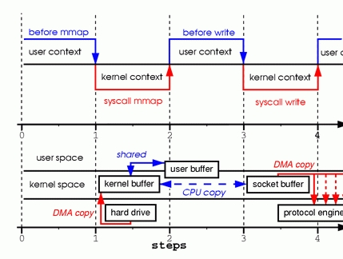

# OS

## Context & Context switch
  read(file, tmp_buf, len);
  write(socket, tmp_buf, len);
  
  Step one: the read system call causes a context switch from user mode to kernel 
  mode. The first copy is performed by the DMA engine, which reads file contents 
  from the disk and stores them into a kernel address space buffer.

  Step two: data is copied from the kernel buffer into the user buffer, and the 
  read system call returns. The return from the call caused a context switch from 
  kernel back to user mode. Now the data is stored in the user address space buffer, 
  and it can begin its way down again.

  Step three: the write system call causes a context switch from user mode to kernel 
  mode. A third copy is performed to put the data into a kernel address space buffer 
  again. This time, though, the data is put into a different buffer, a buffer that 
  is associated with sockets specifically.

  Step four: the write system call returns, creating our fourth context switch. 
  Independently and asynchronously, a fourth copy happens as the DMA engine passes 
  the data from the kernel buffer to the protocol engine. You are probably asking 
  yourself, “What do you mean independently and asynchronously? Wasnot the data 
  transmitted before the call returned?” Call return, in fact, doesnot guarantee 
  transmission; it doesnot even guarantee the start of the transmission. It simply 
  means the Ethernet driver had free descriptors in its queue and has accepted 
  our data for transmission. There could be numerous packets queued before ours. 
  Unless the driver/hardware implements priority rings or queues, data is transmitted 
  on a first-in-first-out basis. (The forked DMA copy in Figure 1 illustrates the 
  fact that the last copy can be delayed).


  tmp_buf = mmap(file, len);
  write(socket, tmp_buf, len);
  
  Step one: the mmap system call causes the file contents to be copied into a 
  kernel buffer by the DMA engine. The buffer is shared then with the user process,
  without any copy being performed between the kernel and user memory spaces.

  Step two: the write system call causes the kernel to copy the data from the 
  original kernel buffers into the kernel buffers associated with sockets.

  Step three: the third copy happens as the DMA engine passes the data from the 
  kernel socket buffers to the protocol engine.

## Memory management
  * mm_struct 
    each process has a memory desriptor which represents address space of a process. 
    It use a list and a rbtree to store memory areas (vm_area_struct), thread in 
    a process just process share same mm_struct with each other.

  * vm_area_struct
    It describes a single memory area over a contiguous interval in a give address 
    space. Each memory area possesses certain properities such as permissions and a
    set of associated operations.
    int main(int argc, char *argv[]) {
      return 0;
    }
    rlove@wolf:~$ pmap 1426 
    example[1426]
    00e80000 (1212 KB)  r-xp (03:01 208530)   /lib/tls/libc-2.5.1.so   text
    00faf000 (12 KB)    rw-p (03:01 208530)   /lib/tls/libc-2.5.1.so   data
    00fb2000 (8 KB)     rw-p (00:00 0)                                 bss
    08048000 (4 KB)     r-xp (03:03 439029)   /home/rlove/src/example  text
    08049000 (4 KB)     rw-p (03:03 439029)   /home/rlove/src/example  data
    40000000 (84 KB)    r-xp (03:01 80276)    /lib/ld-2.5.1.so         text
    40015000 (4 KB)     rw-p (03:01 80276)    /lib/ld-2.5.1.so         data
    4001e000 (4 KB)     rw-p (00:00 0)                                 bss
    bfffe000 (8 KB)     rwxp (00:00 0)        [stack]
    mapped: 1340 KB writable/private: 40 KB shared: 0 KB
    p stands for private

    do_mmap() is the function used to add an address interval to a process’s 
    address space—whether that means expanding an existing memory area or 
    creating a new one.
    unsigned long do_mmap(struct file *file, 
                          unsigned long addr, 
                          unsigned long len, 
                          unsigned long prot,
                          unsigned long flag, 
                          unsigned long offset)
    This function maps the file specified by file at offset offset for length 
    len. The file parameter can be NULL and offset can be zero, in which case 
    the mapping will not be backed by a file. In that case, this is called 
    an anonymous mapping. If a file and offset are provided, the mapping is 
    called a file-backed mapping.

  * Page tables
    Although applications operate on virtual memory mapped to physical addresses, 
    processors operate directly on those physical addresses. Consequently, when 
    an application accesses a virtual memory address, it must first be converted 
    to a physical address before the processor can resolve the request. Performing 
    this lookup is done via page tables. Page tables work by splitting the virtual 
    address into chunks. Each chunk is used as an index into a table.The table 
    points to either another table or the associated physical page.

    PDT look up is implemented by hardware, and the data is setup by processor.
    TLB(translation lookaside buffer) acts as a hardware cache of virtual-to-physical
    mapping.

## word Size and Data Types
    A word is the amount of data that a machine can process at one time. A word 
    is an integer number of bytes—for example, one, two, four, or eight.When someone 
    talks about the “n-bits” of a machine, they are generally talking about the 
    machine’s word size. For example, when people say that the Intel i7 is a 
    64-bit chip, they are referring to its word size, which is 64 bits, or eight 
    bytes.

    The size of a processor’s general-purpose registers (GPRs) is equal to its 
    word size.The widths of the components in a given architecture—for example, 
    the memory bus—are usually at least as wide as the word size.Typically, 
    at least in the architectures that Linux supports, the virtual memory address 
    space is equal to the word size, although the physical address space is 
    sometimes less. Consequently, the size of a pointer is equal to the word 
    size. Additionally, the size of the C type long is equal to the word size, 
    whereas the size of the int type is sometimes less than that of the word size. 

    The C standard explicitly leaves the size of the standard variable types up 
    to implementations. The uncertainty in the standard C types across 
    architectures is both a pro and a con. On the plus side, the standard types 
    can take advantage of the word size of various architectures, and types need 
    not explicitly specify a size.The size of the C long type is guaranteed to 
    be the machine’s word size. On the downside, however, code cannot assume that 
    the standard C types have any specific size. Furthermore, there is no guarantee 
    that an int is the same size as a long.

  * Socket
    A TCP/UDP connection is identified by a tuple of five values: 
      {<protocol>, <src addr>, <src port>, <dest addr>, <dest port>}
    Any unique combination of these values identifies a connection. As a result, 
    no two connections can have the same five values, otherwise the system would not 
    be able to distinguish these connections any longer.
    The protocol of a socket is set when a socket is created with the socket() function. 
    The source address and port are set with the bind() function. The destination address 
    and port are set with the connect() function. Since UDP is a connectionless protocol, 
    UDP sockets can be used without connecting them. Yet it is allowed to connect them and 
    in some cases very advantageous for your code and general application design. In 
    connectionless mode, UDP sockets that were not explicitly bound when data is sent over 
    them for the first time are usually automatically bound by the system, as an unbound UDP 
    socket cannot receive any (reply) data. Same is true for an unbound TCP socket, it is 
    automatically bound before it will be connected.

    If you explicitly bind a socket, it is possible to bind it to port 0, which means "any port". 
    Since a socket cannot really be bound to all existing ports, the system will have to 
    choose a specific port itself in that case (usually from a predefined, OS specific 
    range of source ports). A similar wildcard exists for the source address, which can 
    be "any address" (0.0.0.0 in case of IPv4 and :: in case of IPv6). Unlike in case of 
    ports, a socket can really be bound to "any address" which means "all source IP addresses 
    of all local interfaces". If the socket is connected later on, the system has to choose 
    a specific source IP address, since a socket cannot be connected and at the same time be 
    bound to any local IP address. Depending on the destination address and the content of 
    the routing table, the system will pick an appropriate source address and replace the 
    "any" binding with a binding to the chosen source IP address.
  
    A socket has a send buffer and if a call to the send() function succeeds, it does not 
    mean that the requested data has actually really been sent out, it only means the data 
    has been added to the send buffer. For UDP sockets, the data is usually sent pretty soon, 
    if not immediately, but for TCP sockets, there can be a relatively long delay between 
    adding data to the send buffer and having the TCP implementation really send that data. 
    As a result, when you close a TCP socket, there may still be pending data in the send buffer, 
    which has not been sent yet but your code considers it as sent, since the send() call succeeded. 
    If the TCP implementation was closing the socket immediately on your request, all of this 
    data would be lost and your code wouldn't even know about that. TCP is said to be a 
    reliable protocol and losing data just like that is not very reliable. That's why a socket 
    that still has data to send will go into a state called TIME_WAIT when you close it. In 
    that state it will wait until all pending data has been successfully sent or until a 
    timeout is hit, in which case the socket is closed forcefully.

    The amount of time the kernel will wait before it closes the socket, regardless if it 
    still has pending send data or not, is called the Linger Time. The Linger Time is globally 
    configurable on most systems and by default rather long (two minutes is a common value 
    you will find on many systems). It is also configurable per socket using the socket option 
    SO_LINGER which can be used to make the timeout shorter or longer, and even to disable it 
    completely. Disabling it completely is a very bad idea, though, since closing a TCP socket 
    gracefully is a slightly complex process and involves sending forth and back a couple of 
    packets (as well as resending those packets in case they got lost) and this whole close 
    process is also limited by the Linger Time. If you disable lingering, your socket may not 
    only lose pending data, it is also always closed forcefully instead of gracefully, which 
    is usually not recommended. And even if you disabled lingering with SO_LINGER, if your process 
    dies without explicitly closing the socket, BSD (and possibly other systems) will linger 
    nonetheless, ignoring what you have configured. This will happen for example if your code 
    just calls exit() (pretty common for tiny, simple server programs) or the process is killed 
    by a signal (which includes the possibility that it simply crashes because of an illegal 
    memory access). So there is nothing you can do to make sure a socket will never linger under 
    all circumstances. 

    The question is, how does the system treat a socket in state TIME_WAIT? If SO_REUSEADDR is 
    not set, a socket in state TIME_WAIT is considered to still be bound to the source address 
    and port and any attempt to bind a new socket to the same address and port will fail until 
    the socket has really been closed, which may take as long as the configured Linger Time. 
    So donot expect that you can rebind the source address of a socket immediately after closing 
    it. In most cases this will fail. However, if SO_REUSEADDR is set for the socket you are 
    trying to bind, another socket bound to the same address and port in state TIME_WAIT is 
    simply ignored, after all its already "half dead", and your socket can bind to exactly the 
    same address without any problem. In that case it plays no role that the other socket may 
    have exactly the same address and port. Note that binding a socket to exactly the same address 
    and port as a dying socket in TIME_WAIT state can have unexpected, and usually undesired, 
    side effects in case the other socket is still "at work" 

* DIO(direct IO)
  * 
* AIO/DIO(async Direct IO)
  

 ```
  计世资讯（CCW Research）预计，按照销售额计算，2016年中国服务器虚拟化市场规模将达到21.7亿元。 
  到2020年，市场规模将达到44.1亿元。
 ```

## Virtualization Solution & CMP(Cloud Management Platform)

### VMWare

### OpenStack

## Why Virtualization & Private Cloud?
* Converged Infrastructure 
    * Virtual Machine/Compute
        * Cloud compution(On-demand self service, Resource pooling, Rapid elasticity, Measured service)
        * Multi-tenant isolation and resource limitation

    * Virtual Network
        * Central control over/knowledge of logical network topology
        * Decouple control and data plane
        * Network isolation
        * Virtualize network device(switch, router, load balance, firewall)
        * Programmatic integration with CMP

    * Virtual Storage
* Benefit
    * Wire once
    * Agility and flexibility 
    * Visibility 

* Virtual device
    * Distributed version(vDS), software is much easier to create abstraction

## Common Networking Challenges in Private Cloud Environment

* Manually Network configuration for VM is time-consuming and error-prone
* Solutions lack visibility and auditing capability
* Lack of centrialize IP address and DNS managelent

## Available Solution

### Infoblox Cloud Network Automation

* Support mainstream cloud management platform(CMP, 2014)
* Architecutre 
    * Adaptor
    * Cloud Platform Applicance
    * Grid Master

    Infoblox Cloud Platform Appliances are fully virtualized Infoblox Grid members
    that run on ESXi, Hyper-V, KVM or XenServer hypervisors. They deliver the full suite
    of Infoblox DNS, DHCP, and IPAM to cloud environments such as VMware,
    OpenStack, and Microsoft. These appliances, optimized for cloud deployments
    in the data center, also deliver a range of cloud-enabling functions including:
      * Automated IP address provisioning and reclamation when VMs are decommissioned
      * Automated DNS naming and reclamation when VMs are decommissioned
      * Automated DHCP lease assignment with fixed address support—especially
        important in OpenStack environments

### Our plan
  * Network view support/ virtual zdns slave
  * VMWare plugin
  * Openstack ipam agent
