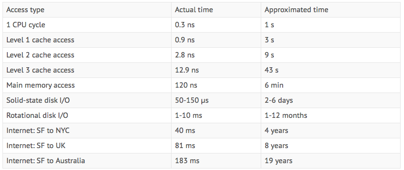
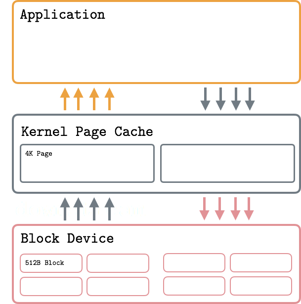
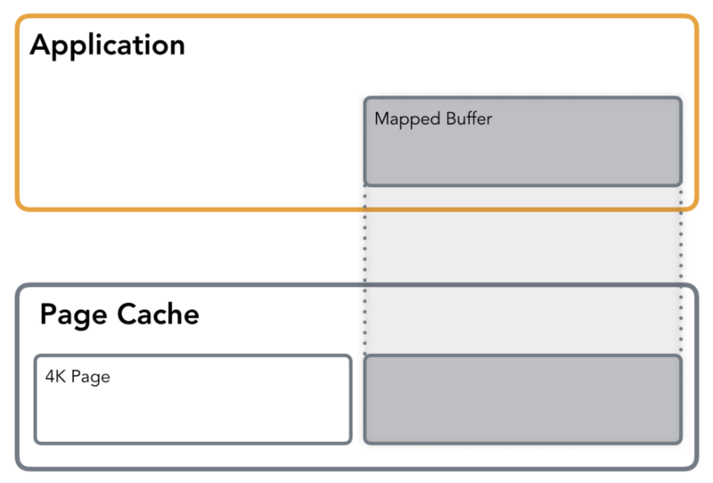
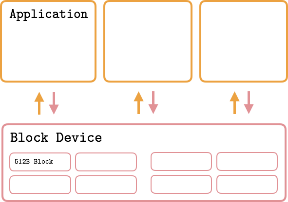
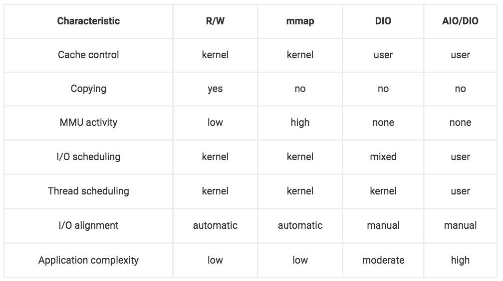

# Storage
computer time

1. OS level file
1. Rational DB
1. NOSql DB


## OS level file
* Traditional IO
  * 

* Mmap
  * mmap avoid the data copy from page cache to user application 
  

fadvise could be used to help the kernel to adjust and optimise the use of page cache
FADV_RANDOM: disable read ahead, greeing the memory 
FADV_SEQUENTIAL: encourage OS to read ahead
FADV_WILLNEED: notifies OS that the page will be needed in the near feature, the opposite
is FADV_DONTNEED

* DIO(direct IO)
  * 
* AIO/DIO(async Direct IO)
  

 ```
 ```

## Rational DB

### Postgresql

## NOSql
* problems with RDBMS
  * complex join cause slow queries
  * horizontal scaling, automatic sharding, distribute transcation 
  * hard to automatic replication
  * node failure resistence
  * more relax schema/real model doesnot map well to the relational model 
* BASE
  * Basically available
  * soft-state
  * eventual consistency
* CAP
  * Consistency
  * Availability --- node failure & performance downgrade
  * Partition-tolerate, aribitrarily many messages could be lost

## Volume manager
* Logical volume manager(LVM) enable dynamic extension file system capacity
  and efficient storage management. LVM is an itermediate layer between the 
  file system and physical disk, LVM virtualize the underlaying storage media
* journaling and nonjournaling file system
* extern storage access
  Fiber Channel(FC), iSCSI are protocols used for accessing data from an external
  storage device or subsystem. Data can be accessed over a network in one of the
  following ways: block level, file level and object level
* Flash drive == solid state drive(SSD)
  page(4, 8, 16k) --> blocks (32, 64, 128 pages)
  read could at page level, whereas write and erase operation at block level
* RAID
  Striping: spread data across multiple rivers to use the drives in parallel
  Mirror
  Parity: additional disk drive to hold parity which is a mathematical construct that
  allows re-creation of the missing data
  


    * Virtual Machine/Compute
        * Cloud compution(On-demand self service, Resource pooling, Rapid elasticity, Measured service)
        * Multi-tenant isolation and resource limitation

    * Virtual Network
        * Central control over/knowledge of logical network topology
        * Decouple control and data plane
        * Network isolation
        * Virtualize network device(switch, router, load balance, firewall)
        * Programmatic integration with CMP

    * Virtual Storage
* Benefit
    * Wire once
    * Agility and flexibility 
    * Visibility 

* Virtual device
    * Distributed version(vDS), software is much easier to create abstraction

## Common Networking Challenges in Private Cloud Environment

* Manually Network configuration for VM is time-consuming and error-prone
* Solutions lack visibility and auditing capability
* Lack of centrialize IP address and DNS managelent

## Available Solution

### Infoblox Cloud Network Automation

* Support mainstream cloud management platform(CMP, 2014)
* Architecutre 
    * Adaptor
    * Cloud Platform Applicance
    * Grid Master

    Infoblox Cloud Platform Appliances are fully virtualized Infoblox Grid members
    that run on ESXi, Hyper-V, KVM or XenServer hypervisors. They deliver the full suite
    of Infoblox DNS, DHCP, and IPAM to cloud environments such as VMware,
    OpenStack, and Microsoft. These appliances, optimized for cloud deployments
    in the data center, also deliver a range of cloud-enabling functions including:
      * Automated IP address provisioning and reclamation when VMs are decommissioned
      * Automated DNS naming and reclamation when VMs are decommissioned
      * Automated DHCP lease assignment with fixed address support—especially
        important in OpenStack environments

### Our plan
  * Network view support/ virtual zdns slave
  * VMWare plugin
  * Openstack ipam agent
